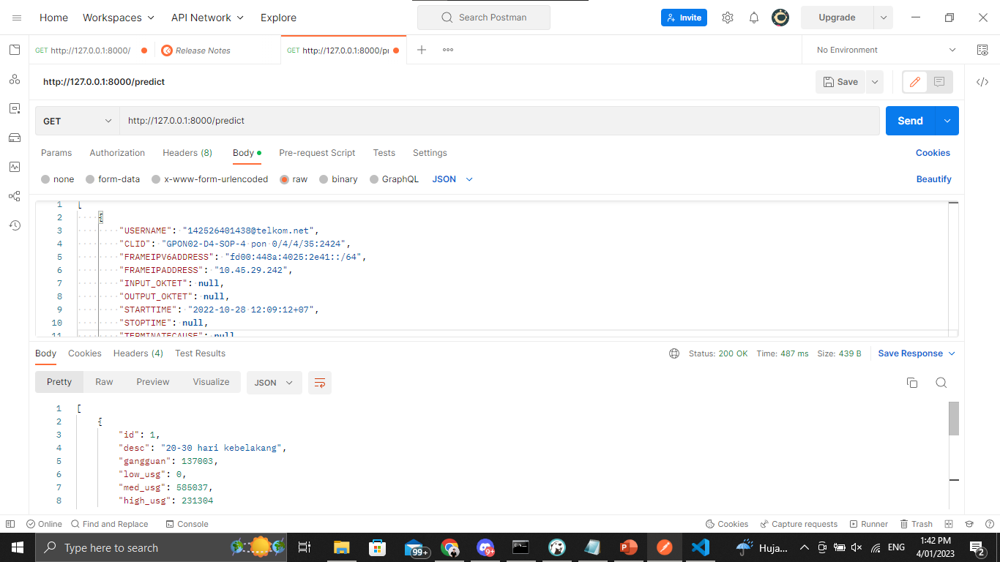

# Analysis Profile Customer (Single)

## Data
Data Usage Customer, feature used in the model:
* USERNAME
* CLID
* FRAMEIPV6ADDRESS
* FRAMEIPADDRESS
* INPUT_OKTET
* OUTPUT_OKTET
* STARTTIME
* STOPTIME
* TERMINATECAUSE
* TOTALUSAGE
* USAGETIME
* STATUSKONEKSI

## Team Member
1. Syachrul Qolbi Nur Septi

## Table of Contents
1. [Requirements](#requirements) to install on your system
2. [Tutorial](#tutorial)

## Requirements

The main requirements are listed below:

Tested with 
* Python 3.7.10
* Pandas 1.1.5

Additional requirements to generate dataset:

* FastAPI
* Pydantic

## Tutorial
# Instalasi Python

Pastikan sudah terinstall python dan pip dalam system anda, jika system anda mengunakan linux bisa mengikuti command di bawah ini

`
sudo apt install python3-pip
`

jika system mengunakan OS windows atau yang lain bisa minjau situs resmi python untuk instalasi python https://www.python.org/downloads/

# Instalasi Dependency 
Agar code dapat berjalan di perlukan beberapa dependecy, dapat langsung menjalankan command di terminal berikut satu demi satu jika python dan pip sudah terinstall

```
pip install fastapi
pip install uvicorn
```

# Menjalankan API
Untuk menjalankan API cukup mejalankan command berikut di terminal
```
uvicorn main:app --reload
```
Secara default dia akan jalan secara lokal di 127.0.0.1 dengan port 8000 

Output jika runnning berhasil

 

Jika ingin di jalankan di port dan address host yang berbeda bisa mengunakan option --host dan --port
```
uvicorn --host [host address] --port [nilai port]  main:app --reload 
```

# Menggunakan API
Kita akan memprediksi status berlangganan user, apakah user tersebut akan berlangganan kembali di bulan depan atau tidak. Untuk mengunakan endpoint bisa dengan menyiapkan body parameternya berupa format JSON dengan format seperti berikut

```
[
        {
            "USERNAME": "1234567890@telkom.net",
            "CLID": "GPON04-D5-GSK-3 pon 1/1/08/8/36/2:3835",
            "FRAMEIPV6ADDRESS": "fd00:448a:5020::/64",
            "FRAMEIPADDRESS": "180.253.137.77",
            "INPUT_OKTET": null,
            "OUTPUT_OKTET": null,
            "STARTTIME": "2023-01-05 13:41:14+07",
            "STOPTIME": null,
            "TERMINATECAUSE": null,
            "TOTALUSAGE": 0,
            "USAGETIME": 2394033,
            "STATUSKONEKSI": "Interim-Update"
        },
        {
            "USERNAME": "1234567890@telkom.net",
            "CLID": "GPON04-D5-GSK-3 pon 1/1/08/8/36/2:3835",
            "FRAMEIPV6ADDRESS": null,
            "FRAMEIPADDRESS": null,
            "INPUT_OKTET": 0,
            "OUTPUT_OKTET": 0,
            "STARTTIME": "2023-01-05 13:33:48+07",
            "STOPTIME": "2023-01-05 13:41:13+07",
            "TERMINATECAUSE": null,
            "TOTALUSAGE": 0,
            "USAGETIME": 445000,
            "STATUSKONEKSI": "Stop"
        },
        {
            "USERNAME": "1234567890@telkom.net",
            "CLID": "GPON04-D5-GSK-3 pon 1/1/08/8/36/2:3835",
            "FRAMEIPV6ADDRESS": "fd00:448a:5020::/64",
            "FRAMEIPADDRESS": "125.164.228.92",
            "INPUT_OKTET": 2158001105,
            "OUTPUT_OKTET": 14842268876,
            "STARTTIME": "2023-01-04 21:57:28+07",
            "STOPTIME": "2023-01-05 13:33:47+07",
            "TERMINATECAUSE": "Lost-Carrier",
            "TOTALUSAGE": 17000269981,
            "USAGETIME": 56179000,
            "STATUSKONEKSI": "Stop",
            "tsm": 1672844248000
        },
        {
            "USERNAME": "1234567890@telkom.net",
            "CLID": "GPON04-D5-GSK-3 pon 1/1/08/8/36/2:3835",
            "FRAMEIPV6ADDRESS": null,
            "FRAMEIPADDRESS": null,
            "INPUT_OKTET": 0,
            "OUTPUT_OKTET": 0,
            "STARTTIME": "2023-01-04 21:56:45+07",
            "STOPTIME": "2023-01-04 21:57:27+07",
            "TERMINATECAUSE": null,
            "TOTALUSAGE": 0,
            "USAGETIME": 42000,
            "STATUSKONEKSI": "Stop"
        },
        {
            "USERNAME": "1234567890@telkom.net",
            "CLID": "GPON04-D5-GSK-3 pon 1/1/08/8/36/2:3835",
            "FRAMEIPV6ADDRESS": "fd00:448a:5020::/64",
            "FRAMEIPADDRESS": "61.5.54.38",
            "INPUT_OKTET": 28559402,
            "OUTPUT_OKTET": 380278687,
            "STARTTIME": "2023-01-04 21:47:24+07",
            "STOPTIME": "2023-01-04 21:56:44+07",
            "TERMINATECAUSE": "Lost-Carrier",
            "TOTALUSAGE": 408838089,
            "USAGETIME": 560000,
            "STATUSKONEKSI": "Stop",
            "tsm": 1672843644000
        },
        {
            "USERNAME": "1234567890@telkom.net",
            "CLID": "GPON04-D5-GSK-3 pon 1/1/08/8/36/2:3835",
            "FRAMEIPV6ADDRESS": null,
            "FRAMEIPADDRESS": null,
            "INPUT_OKTET": 0,
            "OUTPUT_OKTET": 0,
            "STARTTIME": "2023-01-04 21:46:45+07",
            "STOPTIME": "2023-01-04 21:47:23+07",
            "TERMINATECAUSE": null,
            "TOTALUSAGE": 0,
            "USAGETIME": 38000,
            "STATUSKONEKSI": "Stop"
        },
        {
            "USERNAME": "1234567890@telkom.net",
            "CLID": "GPON04-D5-GSK-3 pon 1/1/08/8/36/2:3835",
            "FRAMEIPV6ADDRESS": "fd00:448a:5020::/64",
            "FRAMEIPADDRESS": "61.5.71.236",
            "INPUT_OKTET": 6338885848,
            "OUTPUT_OKTET": 69408005672,
            "STARTTIME": "2023-01-03 05:47:28+07",
            "STOPTIME": "2023-01-04 21:46:44+07",
            "TERMINATECAUSE": "Lost-Carrier",
            "TOTALUSAGE": 75746891520,
            "USAGETIME": 143956000,
            "STATUSKONEKSI": "Stop",
            "tsm": 1672699648000
        },
        {
            "USERNAME": "1234567890@telkom.net",
            "CLID": "GPON04-D5-GSK-3 pon 1/1/08/8/36/2:3835",
            "FRAMEIPV6ADDRESS": null,
            "FRAMEIPADDRESS": null,
            "INPUT_OKTET": 0,
            "OUTPUT_OKTET": 0,
            "STARTTIME": "2023-01-03 05:45:17+07",
            "STOPTIME": "2023-01-03 05:47:27+07",
            "TERMINATECAUSE": null,
            "TOTALUSAGE": 0,
            "USAGETIME": 130000,
            "STATUSKONEKSI": "Stop"
        },
        {
            "USERNAME": "1234567890@telkom.net",
            "CLID": "GPON04-D5-GSK-3 pon 1/1/08/8/36/2:3835",
            "FRAMEIPV6ADDRESS": "fd00:448a:5020::/64",
            "FRAMEIPADDRESS": "10.169.111.210",
            "INPUT_OKTET": 1099903,
            "OUTPUT_OKTET": 1863889,
            "STARTTIME": "2023-01-03 05:18:16+07",
            "STOPTIME": "2023-01-03 05:45:16+07",
            "TERMINATECAUSE": "Lost-Carrier",
            "TOTALUSAGE": 2963792,
            "USAGETIME": 1620000,
            "STATUSKONEKSI": "Stop",
            "tsm": 1672697896000
        },
        {
            "USERNAME": "1234567890@telkom.net",
            "CLID": "GPON04-D5-GSK-3 pon 1/1/08/8/36/2:3835",
            "FRAMEIPV6ADDRESS": null,
            "FRAMEIPADDRESS": null,
            "INPUT_OKTET": 0,
            "OUTPUT_OKTET": 0,
            "STARTTIME": "2023-01-03 05:14:17+07",
            "STOPTIME": "2023-01-03 05:18:15+07",
            "TERMINATECAUSE": null,
            "TOTALUSAGE": 0,
            "USAGETIME": 238000,
            "STATUSKONEKSI": "Stop"
        },
        {
            "USERNAME": "1234567890@telkom.net",
            "CLID": "GPON04-D5-GSK-3 pon 1/1/08/8/36/2:3835",
            "FRAMEIPV6ADDRESS": "fd00:448a:5020::/64",
            "FRAMEIPADDRESS": "10.88.201.200",
            "INPUT_OKTET": 1554222646,
            "OUTPUT_OKTET": 5462420480,
            "STARTTIME": "2023-01-02 22:01:56+07",
            "STOPTIME": "2023-01-03 05:14:16+07",
            "TERMINATECAUSE": "Lost-Carrier",
            "TOTALUSAGE": 7016643126,
            "USAGETIME": 25940000,
            "STATUSKONEKSI": "Stop",
            "tsm": 1672671716000
        },
        {
            "USERNAME": "1234567890@telkom.net",
            "CLID": "GPON04-D5-GSK-3 pon 1/1/08/8/36/2:3835",
            "FRAMEIPV6ADDRESS": null,
            "FRAMEIPADDRESS": null,
            "INPUT_OKTET": 0,
            "OUTPUT_OKTET": 0,
            "STARTTIME": "2023-01-02 22:00:13+07",
            "STOPTIME": "2023-01-02 22:01:55+07",
            "TERMINATECAUSE": null,
            "TOTALUSAGE": 0,
            "USAGETIME": 102000,
            "STATUSKONEKSI": "Stop"
        },
        {
            "USERNAME": "1234567890@telkom.net",
            "CLID": "GPON04-D5-GSK-3 pon 1/1/08/8/36/2:3835",
            "FRAMEIPV6ADDRESS": "fd00:448a:5020::/64",
            "FRAMEIPADDRESS": "180.246.248.241",
            "INPUT_OKTET": 577599083,
            "OUTPUT_OKTET": 8390389697,
            "STARTTIME": "2023-01-02 16:11:32+07",
            "STOPTIME": "2023-01-02 22:00:12+07",
            "TERMINATECAUSE": "Lost-Carrier",
            "TOTALUSAGE": 8967988780,
            "USAGETIME": 20920000,
            "STATUSKONEKSI": "Stop",
            "tsm": 1672650692000
        },
        {
            "USERNAME": "1234567890@telkom.net",
            "CLID": "GPON04-D5-GSK-3 pon 1/1/08/8/36/2:3835",
            "FRAMEIPV6ADDRESS": null,
            "FRAMEIPADDRESS": null,
            "INPUT_OKTET": 0,
            "OUTPUT_OKTET": 0,
            "STARTTIME": "2023-01-02 16:11:06+07",
            "STOPTIME": "2023-01-02 16:11:31+07",
            "TERMINATECAUSE": null,
            "TOTALUSAGE": 0,
            "USAGETIME": 25000,
            "STATUSKONEKSI": "Stop"
        },
        {
            "USERNAME": "1234567890@telkom.net",
            "CLID": "GPON04-D5-GSK-3 pon 1/1/08/8/36/2:3835",
            "FRAMEIPV6ADDRESS": "fd00:448a:5020::/64",
            "FRAMEIPADDRESS": "10.88.143.81",
            "INPUT_OKTET": 31962766,
            "OUTPUT_OKTET": 231984268,
            "STARTTIME": "2023-01-02 15:57:44+07",
            "STOPTIME": "2023-01-02 16:11:05+07",
            "TERMINATECAUSE": "Lost-Carrier",
            "TOTALUSAGE": 263947034,
            "USAGETIME": 801000,
            "STATUSKONEKSI": "Stop",
            "tsm": 1672649864000
        },
        {
            "USERNAME": "1234567890@telkom.net",
            "CLID": "GPON04-D5-GSK-3 pon 1/1/08/8/36/2:3835",
            "FRAMEIPV6ADDRESS": null,
            "FRAMEIPADDRESS": null,
            "INPUT_OKTET": 0,
            "OUTPUT_OKTET": 0,
            "STARTTIME": "2023-01-02 15:55:03+07",
            "STOPTIME": "2023-01-02 15:57:43+07",
            "TERMINATECAUSE": null,
            "TOTALUSAGE": 0,
            "USAGETIME": 160000,
            "STATUSKONEKSI": "Stop"
        },
        {
            "USERNAME": "1234567890@telkom.net",
            "CLID": "GPON04-D5-GSK-3 pon 1/1/08/8/36/2:3835",
            "FRAMEIPV6ADDRESS": "fd00:448a:5020::/64",
            "FRAMEIPADDRESS": "125.164.226.50",
            "INPUT_OKTET": 3453010547,
            "OUTPUT_OKTET": 36897312572,
            "STARTTIME": "2022-12-31 23:50:05+07",
            "STOPTIME": "2023-01-02 15:55:02+07",
            "TERMINATECAUSE": "Lost-Carrier",
            "TOTALUSAGE": 40350323119,
            "USAGETIME": 144297000,
            "STATUSKONEKSI": "Stop",
            "tsm": 1672505405000
        }
]
```
dan untuk URL API mengunakan format sebagai berikut
```
http://[Host]:[Port]/predict
```
dan request method yang digunakan adalah **GET** 
API akan mengembalikan variabel Percentage dan Predict Description beserta valuenya dengan tipe data JSON.

## Hasil Retun API
```
{
    "detail": [
        {
            "id": 3,
            "desc": "gangguan",
            "nd": "1234567890",
            "start_date": "2023-01-05T06:33:48+00:00",
            "end_date": "2023-01-05T06:41:13+00:00",
            "duration": 445,
            "total_usage_byte": 0,
            "duration_hour": 0,
            "usage_hour_byte": 0.0
        },
        {
            "id": 3,
            "desc": "high_usg",
            "nd": "1234567890",
            "start_date": "2023-01-04T14:57:28+00:00",
            "end_date": "2023-01-05T06:33:47+00:00",
            "duration": 56179,
            "total_usage_byte": 17000269981,
            "duration_hour": 16,
            "usage_hour_byte": 1089392333.996689
        },
        {
            "id": 3,
            "desc": "gangguan",
            "nd": "1234567890",
            "start_date": "2023-01-04T14:56:45+00:00",
            "end_date": "2023-01-04T14:57:27+00:00",
            "duration": 42,
            "total_usage_byte": 0,
            "duration_hour": 0,
            "usage_hour_byte": 0.0
        },
        {
            "id": 3,
            "desc": "high_usg",
            "nd": "1234567890",
            "start_date": "2023-01-04T14:47:24+00:00",
            "end_date": "2023-01-04T14:56:44+00:00",
            "duration": 560,
            "total_usage_byte": 408838089,
            "duration_hour": 0,
            "usage_hour_byte": 2628244857.857143
        },
        {
            "id": 3,
            "desc": "gangguan",
            "nd": "1234567890",
            "start_date": "2023-01-04T14:46:45+00:00",
            "end_date": "2023-01-04T14:47:23+00:00",
            "duration": 38,
            "total_usage_byte": 0,
            "duration_hour": 0,
            "usage_hour_byte": 0.0
        },
        {
            "id": 3,
            "desc": "high_usg",
            "nd": "1234567890",
            "start_date": "2023-01-02T22:47:28+00:00",
            "end_date": "2023-01-04T14:46:44+00:00",
            "duration": 143956,
            "total_usage_byte": 75746891520,
            "duration_hour": 40,
            "usage_hour_byte": 1894251086.9432325
        },
        {
            "id": 3,
            "desc": "gangguan",
            "nd": "1234567890",
            "start_date": "2023-01-02T22:45:17+00:00",
            "end_date": "2023-01-02T22:47:27+00:00",
            "duration": 130,
            "total_usage_byte": 0,
            "duration_hour": 0,
            "usage_hour_byte": 0.0
        },
        {
            "id": 3,
            "desc": "gangguan",
            "nd": "1234567890",
            "start_date": "2023-01-02T22:18:16+00:00",
            "end_date": "2023-01-02T22:45:16+00:00",
            "duration": 1620,
            "total_usage_byte": 2963792,
            "duration_hour": 0,
            "usage_hour_byte": 6586204.444444444
        },
        {
            "id": 3,
            "desc": "gangguan",
            "nd": "1234567890",
            "start_date": "2023-01-02T22:14:17+00:00",
            "end_date": "2023-01-02T22:18:15+00:00",
            "duration": 238,
            "total_usage_byte": 0,
            "duration_hour": 0,
            "usage_hour_byte": 0.0
        },
        {
            "id": 3,
            "desc": "med_usg",
            "nd": "1234567890",
            "start_date": "2023-01-02T15:01:56+00:00",
            "end_date": "2023-01-02T22:14:16+00:00",
            "duration": 25940,
            "total_usage_byte": 7016643126,
            "duration_hour": 7,
            "usage_hour_byte": 973782392.1973785
        },
        {
            "id": 3,
            "desc": "gangguan",
            "nd": "1234567890",
            "start_date": "2023-01-02T15:00:13+00:00",
            "end_date": "2023-01-02T15:01:55+00:00",
            "duration": 102,
            "total_usage_byte": 0,
            "duration_hour": 0,
            "usage_hour_byte": 0.0
        },
        {
            "id": 3,
            "desc": "high_usg",
            "nd": "1234567890",
            "start_date": "2023-01-02T09:11:32+00:00",
            "end_date": "2023-01-02T15:00:12+00:00",
            "duration": 20920,
            "total_usage_byte": 8967988780,
            "duration_hour": 6,
            "usage_hour_byte": 1543248547.2275336
        },
        {
            "id": 3,
            "desc": "gangguan",
            "nd": "1234567890",
            "start_date": "2023-01-02T09:11:06+00:00",
            "end_date": "2023-01-02T09:11:31+00:00",
            "duration": 25,
            "total_usage_byte": 0,
            "duration_hour": 0,
            "usage_hour_byte": 0.0
        },
        {
            "id": 3,
            "desc": "high_usg",
            "nd": "1234567890",
            "start_date": "2023-01-02T08:57:44+00:00",
            "end_date": "2023-01-02T09:11:05+00:00",
            "duration": 801,
            "total_usage_byte": 263947034,
            "duration_hour": 0,
            "usage_hour_byte": 1186278804.494382
        },
        {
            "id": 3,
            "desc": "gangguan",
            "nd": "1234567890",
            "start_date": "2023-01-02T08:55:03+00:00",
            "end_date": "2023-01-02T08:57:43+00:00",
            "duration": 160,
            "total_usage_byte": 0,
            "duration_hour": 0,
            "usage_hour_byte": 0.0
        },
        {
            "id": 3,
            "desc": "high_usg",
            "nd": "1234567890",
            "start_date": "2022-12-31T16:50:05+00:00",
            "end_date": "2023-01-02T08:55:02+00:00",
            "duration": 144297,
            "total_usage_byte": 40350323119,
            "duration_hour": 40,
            "usage_hour_byte": 1006681796.7691636
        }
    ],
    "summary": [
        {
            "id": 1,
            "desc": "20-30 hari kebelakang",
            "gangguan": 0,
            "low_usg": 0,
            "med_usg": 0,
            "high_usg": 0
        },
        {
            "id": 2,
            "desc": "10-20 hari kebelakang",
            "gangguan": 0,
            "low_usg": 0,
            "med_usg": 0,
            "high_usg": 0
        },
        {
            "id": 3,
            "desc": "0-10 hari kebelakang",
            "gangguan": 2800,
            "low_usg": 0,
            "med_usg": 25940,
            "high_usg": 366713
        }
    ]
}
```
## Contoh mengunakan POSTMAN

